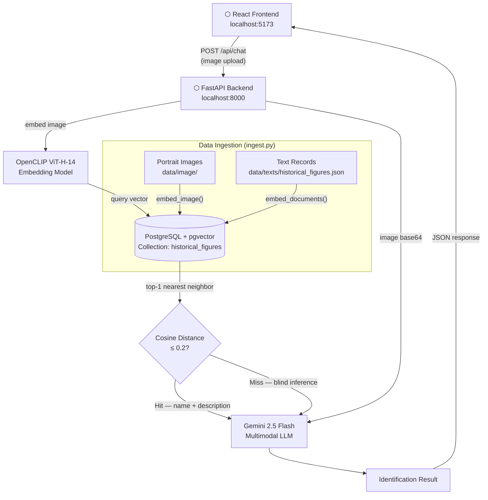

# Ancient RAG Project

A modern Full-Stack Retrieval-Augmented Generation (RAG) web application that identifies ancient historical figures using multi-modal embeddings (OpenCLIP) and generative AI (Gemini).

## Architecture



### File Structure

```text
ancient-rag-project/
├── frontend/                 
│   ├── src/                  
│   └── Dockerfile           
├── backend/                  
│   ├── api.py                # FastAPI entry point
│   ├── ingest.py             # Vector database seeding script
│   ├── query.py              # LLM + Vector Search core logic
│   └── data/
│       ├── image/            # Portraits used to seed the vector database (Embedding data)
│       └── test_queries/     # Input images used for searching and blind-guessing tests     
│   ├── requirements.txt      
│   └── Dockerfile            
├── docker-compose.yml       
├── .env                     
└── init.sql                
```

## Quick Start

### 1. Configure Environment Variables
1. Copy the example environment file: `cp .env.example .env`
2. Open `.env` and fill in your `GEMINI_API_KEY` and Database credentials (`POSTGRES_USER`, `POSTGRES_PASSWORD`, `POSTGRES_DB`).

### 2. Start the Full-Stack Application
Run the following command in the root directory to build and start all services (Database, API, and Web UI):
```bash
docker compose up --build -d
```

### 3. Initialize Data (Data Ingestion)
Because the database starts completely empty, you need to populate it with the historical figure images located in `backend/data/image/`.
Execute the ingestion script **inside** the running backend container:
```bash
docker exec -it ancient-backend python ingest.py
```

### 4. Open the Web Interface
Once the data ingestion is complete, open your browser and navigate to:

**[http://localhost:5173](http://localhost:5173)**

---

### Service Endpoints
- **Frontend Web UI:** `http://localhost:5173`
- **FastAPI Backend API:** `http://localhost:8000`
- **PGAdmin (Database GUI):** `http://localhost:5050`
